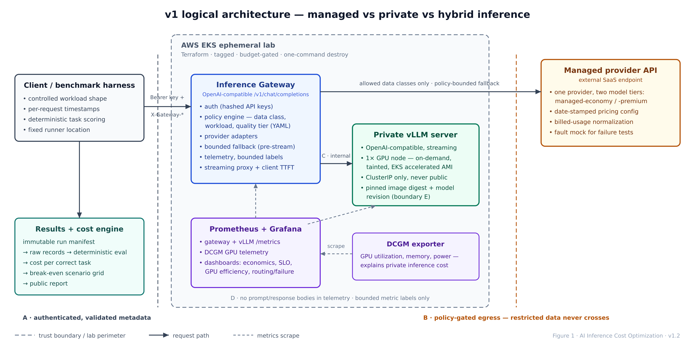
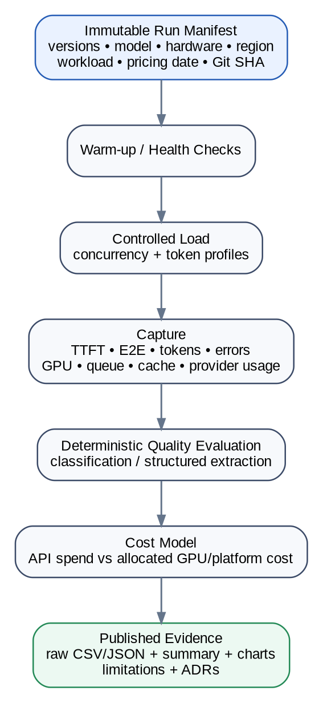
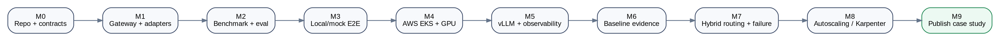

**AI Inference Cost Optimization**

**Technical Implementation Specification**

Agent handoff for Claude / Codex | Version 1.2 | 15 August 2026

> **North-star engineering question** — What is the lowest-cost production AI inference architecture that still meets defined quality, latency, reliability, security and availability requirements? The repository must answer this with reproducible evidence—not with a list of technologies.

**This specification is authoritative for v1. If an implementation choice conflicts with this document, either follow the spec or create an ADR explaining the change before coding it.**

# Document control

| **Field**          | **Value**                                                                              |
|:-------------------|:---------------------------------------------------------------------------------------|
| Document           | AI Inference Cost Optimization - Technical Implementation Specification       |
| Version            | 1.2                                                                                    |
| Date               | 15 August 2026                                                                         |
| Primary repository | ai-inference-cost-optimization                                                         |
| Primary audience   | Claude/Codex implementation agents, repository reviewers, prospective technical buyers |
| Business owner     | Founder-led technical authority                                 |
| Strategic source   | Private founder playbook v2.0                                 |
| Status             | Approved for implementation; v1 scope frozen unless an ADR changes it                  |
| Canonical source   | TECHNICAL_SPEC.md (GitHub-Flavored Markdown); the DOCX is a generated presentation artifact. |

## How agents must use this document

- Treat P0 requirements and milestone acceptance criteria as mandatory. P1 items are implemented only after the P0 baseline is working and measured. P2 items are explicitly out of v1 unless the owner promotes them.

- Do not add technologies because they are fashionable. Every component must support the north-star economic decision or a stated non-functional requirement.

- Do not fabricate benchmark data, client claims, savings percentages, reliability claims, or “enterprise-grade” labels. Lab measurements must be clearly labeled as lab measurements.

- Every benchmark result must be traceable to an immutable run manifest, Git commit, model revision, infrastructure configuration, pricing effective date, and raw output.

- Never commit credentials, employer/client material, private prompts, or licensed data that cannot be redistributed.

- Keep changes small and reviewable. Each material architecture deviation requires an ADR before or in the same change set.

# Contents

1. Purpose, product thesis and engineering principles

2. Goals, non-goals and success criteria

3. Scope priorities (P0/P1/P2)

4. System architecture

5. Reference implementation decisions

6. Repository layout and ownership boundaries

7. Functional requirements

8. API and routing contracts

9. Benchmark and quality-evaluation specification

10. Cost and break-even model

11. AWS/EKS infrastructure specification

12. Kubernetes and vLLM deployment specification

13. Observability and dashboards

14. Reliability and fault-injection tests

15. Security and threat model

16. CI/CD, supply chain and automation

17. Test strategy

18. Milestones and implementation issue map

19. Definition of done and release gate

20. Operational runbooks and cloud-cost safety

21. Documentation and public case-study requirements

22. Phase-2 architecture: KServe / llm-d / advanced inference

23. Agent execution contract

Appendix A - Configuration examples

Appendix B - Result schemas

Appendix C - Suggested initial GitHub issues

Appendix D - Primary technical source notes

# 1. Purpose, product thesis and engineering principles

## 1.1 Purpose

This repository is a commercial proof asset. It is not a tutorial, a framework showcase or a generic “MLOps project.” It must demonstrate the senior architectural judgement required to choose and operate an inference path based on economics and production constraints.

The v1 implementation compares three delivery patterns under a common workload and measurement discipline: (a) a managed model API, (b) a private/self-hosted model served by vLLM on Kubernetes, and (c) a policy-driven hybrid route that can use either path. The system must produce reproducible evidence about quality-adjusted cost, latency, throughput, GPU utilization and failure behavior.

## 1.2 Durable engineering thesis

> **Durable layer** — The business moat is not Kubernetes, vLLM, KServe, llm-d, any GPU model or any LLM vendor. The durable capability is: measure -> model economics -> architect -> optimize -> validate quality/SLO -> automate -> operate -> prove ROI. This specification therefore makes adapters, policies, benchmarks and evidence first-class, while treating runtimes as replaceable implementations.

## 1.3 Non-negotiable engineering principles

| **Principle**                                     | **Required behavior**                                                                                                                             |
|:--------------------------------------------------|:--------------------------------------------------------------------------------------------------------------------------------------------------|
| Evidence before optimization                      | Capture a baseline before tuning batching, caching, quantization, autoscaling or routing.                                                         |
| One change at a time                              | Performance experiments must isolate changes unless the run is explicitly labeled as a combined treatment.                                        |
| Quality-adjusted economics                        | A cheaper model that produces fewer correct tasks is not automatically cheaper. Cost per correct task (`cost_per_correct_task`) is the primary business metric. |
| No universal break-even                           | API vs self-hosted break-even is calculated from token profile, price, GPU/runtime cost, utilization, traffic shape, quality and SLO assumptions. |
| Vendor/runtime agnostic surface                   | The public gateway and benchmark contracts cannot depend on a single model provider or serving runtime.                                           |
| Reproducibility                                   | Every published result includes a machine-readable run manifest and raw/derived data.                                                             |
| Safe cloud lifecycle                              | GPU resources are ephemeral, tagged, budgeted and destroyable by one command.                                                                     |
| Privacy by default                                | Prompts and model outputs are not logged by default. Synthetic data is used for public benchmarks.                                                |
| Production realism without fake production claims | Test failures, scaling, telemetry and security boundaries; explicitly state what the lab does not prove.                                          |
| Scope discipline                                  | Advanced agent/RAG/distributed-serving features are deferred until the baseline commercial question is answered.                                  |

# 2. Goals, non-goals and success criteria

## 2.1 v1 goals

- Expose one stable OpenAI-style chat-completions gateway endpoint that can route to at least one managed provider and one private vLLM endpoint.

- Deploy a single-GPU vLLM baseline on an ephemeral Amazon EKS lab environment using Infrastructure as Code.

- Measure TTFT, end-to-end latency, throughput, input/output token usage, errors, queue/cache behavior, GPU utilization and estimated cost.

- Run objective synthetic business tasks with deterministic scoring so `cost_per_correct_task` can be calculated.

- Produce API-only, private-inference and hybrid-routing benchmark comparisons from the same workload harness.

- Demonstrate policy routing for sensitive workloads and bounded fallback during provider failure.

- Demonstrate at least pod-failure recovery; GPU/node/autoscaling experiments are P1 and opt-in because they can increase cloud cost.

- Publish an architecture diagram, ADRs, benchmark methodology, assumptions, raw results, summarized tables and limitations suitable for a CTO/Head of Platform review.

- Provide a one-command or one-make-target destroy path and verify that expensive resources are removed.

## 2.2 Explicit non-goals for v1

- Training or fine-tuning a foundation model.

- Building a general-purpose AI gateway product or SaaS.

- RAG, vector databases or enterprise document ingestion.

- Agent frameworks, autonomous tools or agent marketplaces.

- Multi-cloud parity across AWS, Azure and GCP.

- Multi-region high availability.

- Multi-node tensor/expert parallelism or prefill/decode disaggregation.

- Hard enterprise billing, chargeback or durable monthly budget enforcement.

- Replacing a commercial API provider with an unsupported reverse-engineered interface.

- Claiming that self-hosting is cheaper before the workload-specific calculation proves it.

## 2.3 v1 success criteria

| **ID** | **Success condition**                                                                                                                                                                                        |
|:-------|:-------------------------------------------------------------------------------------------------------------------------------------------------------------------------------------------------------------|
| SC-01  | A fresh reviewer can run local/mock tests without cloud credentials and understand the architecture in under 15 minutes.                                                                                     |
| SC-02  | A configured AWS lab can be created, a private vLLM model served, benchmarked and destroyed using documented commands.                                                                                       |
| SC-03  | At least one managed provider and the private vLLM endpoint are exercised through the same public gateway contract.                                                                                          |
| SC-04  | Published benchmark data contains enough metadata to reproduce or challenge the result.                                                                                                                      |
| SC-05  | The cost model outputs managed-vs-private scenario curves and does not use a universal requests/month threshold.                                                                                             |
| SC-06  | At least two objective task families produce a deterministic quality score and `cost_per_correct_task` result.                                                                                              |
| SC-07  | A simulated managed-provider 429/5xx/timeout causes policy-compliant fallback without routing restricted data externally.                                                                                    |
| SC-08  | No secrets or prompt bodies appear in Git history, default logs, dashboards or published results.                                                                                                            |
| SC-09  | CI passes lint, unit, contract, integration, IaC validation and secret/container/config scans.                                                                                                               |
| SC-10  | The README is a business case study first and an installation guide second.                                                                                                                                  |
| SC-11  | After the first M6 run, the full cloud reproduce path states a measured expected USD cost band and wall-clock duration. The release reproduction stays within that published bound or explains the variance. |

# 3. Scope priorities (P0 / P1 / P2)

| **Priority**             | **Scope**                                                                                                                                                                                                                                                         |
|:-------------------------|:------------------------------------------------------------------------------------------------------------------------------------------------------------------------------------------------------------------------------------------------------------------|
| P0 - must ship           | Gateway, provider adapters, static policy routing, bounded fallback, auth, vLLM on EKS, Prometheus/Grafana, DCGM GPU metrics, benchmark harness, deterministic quality evaluation, cost engine, raw/summary results, IaC create/destroy, CI validation.           |
| P1 - only after baseline | KEDA scale-out using queue metrics, Karpenter GPU provisioning/consolidation experiment, Spot experiment, persistent cost ledger or hard budget policy, richer traces, NetworkPolicy hardening, actual AWS Cost Explorer reconciliation, energy/request estimate. |
| P2 - future extension    | KServe LLMInferenceService, Gateway API Inference Extension/llm-d, prefix-cache-aware routing, disaggregated prefill/decode, multi-GPU/multi-node, RAG authorization, agents/tools, multi-cloud, private/on-prem reference deployment.                            |

> **Scope freeze** — Claude/Codex must not start P1 or P2 work to “complete the architecture” while any P0 acceptance criterion is failing. P1/P2 issues remain labeled and unassigned until the baseline report exists.

# 4. System architecture



Figure 1. v1 logical architecture. The custom gateway is intentionally thin: provider abstraction, policy, telemetry and failure handling. It must not become a general orchestration framework.

## 4.1 Component responsibilities

| **Component**                 | **Responsibility**                                                                                                                                                                            |
|:------------------------------|:----------------------------------------------------------------------------------------------------------------------------------------------------------------------------------------------|
| Client / benchmark harness    | Sends a common request schema, controls workload shape, captures per-request timestamps and evaluates task correctness.                                                                       |
| Inference Gateway    | Authenticates caller; classifies request from explicit metadata; applies policy; calls provider adapter; proxies streaming; records bounded-cardinality telemetry; performs allowed fallback. |
| Managed provider adapter      | Transforms internal request into provider API; normalizes streaming/non-streaming response, usage and errors; calculates managed API cost from date-stamped pricing config.                   |
| Private vLLM adapter          | Calls the vLLM OpenAI-compatible endpoint; captures usage and optional per-request metrics; never exposes vLLM directly to the public internet.                                               |
| Policy engine                 | Config-driven deterministic rules for data class, workload, quality tier, preferred provider and fallback list. No learned router in v1.                                                      |
| Prometheus/Grafana            | Aggregated operational metrics and dashboards. Not the source of truth for published per-request benchmark records.                                                                           |
| DCGM exporter                 | GPU telemetry used to explain inference behavior and utilization.                                                                                                                             |
| Benchmark results/cost engine | Immutable run manifest + raw request records -> objective eval -> cost allocation -> scenario grid -> public report.                                                                          |

## 4.2 Trust boundaries

- Trust Boundary A - client to gateway: authenticated; request metadata is untrusted input and validated against enums/limits.

- Trust Boundary B - gateway to managed provider: prompts may leave the lab only when the data-class policy allows it. Public benchmark datasets are synthetic.

- Trust Boundary C - gateway to private vLLM: internal-only service; no public load balancer or direct external access.

- Trust Boundary D - telemetry: prompt/response bodies excluded by default. Metrics contain bounded labels only; request IDs are opaque.

- Trust Boundary E - model supply chain: exact model/revision/license is recorded; no unpinned “latest” model revision in published benchmark runs.

# 5. Reference implementation decisions

## 5.1 Concrete v1 technology choices

| **Decision**         | **v1 choice**                                                                                                                                                            |
|:---------------------|:-------------------------------------------------------------------------------------------------------------------------------------------------------------------------|
| Language             | Python 3.12+; pin exact runtime in .python-version/container once implementation starts.                                                                                 |
| Package/tooling      | pyproject.toml + lockfile; uv is preferred if available, but dependency reproducibility matters more than package-manager branding.                                      |
| Gateway              | FastAPI + async HTTP client/provider SDK adapters; expose OpenAI-compatible chat-completions v1 surface.                                                                 |
| Private inference    | vLLM OpenAI-compatible server; one permissively licensed instruction model that fits one GPU, selected and pinned by ADR at implementation time.                         |
| Cloud                | AWS EKS reference implementation only for v1. Cloud abstraction is architectural, not multi-cloud Terraform.                                                             |
| GPU baseline         | One on-demand NVIDIA GPU node using current EKS-optimized accelerated AMI; instance family/type is a variable and recorded in every run.                                 |
| Kubernetes packaging | Helm for application components; Terraform for AWS infrastructure.                                                                                                       |
| Metrics              | Prometheus + Grafana; vLLM /metrics; NVIDIA DCGM exporter for GPU telemetry.                                                                                             |
| Autoscaling          | P1: KEDA with Prometheus metric such as vLLM queue depth; Karpenter experiment only after fixed-node baseline.                                                           |
| Benchmark storage    | Repository-published compact CSV/JSON summaries + raw request JSONL/CSV sized for Git; larger raw artifacts may be release assets/object storage with checksums.         |
| CI                   | GitHub Actions for code/IaC validation. GPU benchmark cloud jobs are manual/operator-driven in v1; do not make expensive cloud access a prerequisite for ordinary PR CI. |

## 5.2 Version pinning policy

- Never use container tag latest in a published benchmark.

- Commit Terraform provider lock files.

- Pin Helm chart versions in a versions file or deployment configuration.

- Pin container image tags and, where practical, immutable digests for published runs.

- Pin model repository revision/commit for published runs.

- At M5 implementation time, select a stable official vLLM release after compatibility testing; pin the exact release and image digest in ADR-009 and the run manifest. As of the specification review on 2026-08-15, the current stable release verified from the upstream release repository is v0.27.1.

- Every benchmark manifest records gateway version/Git SHA, vLLM version, Kubernetes version, GPU driver/CUDA visible to workload, model ID/revision, chart versions and region.

- If a metric name changes across vLLM versions, implement compatibility in the dashboard/query layer rather than hiding the version difference.

## 5.3 Model-selection rule

Do not hard-code a 2026 model name into the architecture. At first implementation, create ADR-009 and select a small instruction model meeting all of these conditions: fits one selected GPU with headroom; supported by the pinned vLLM release; redistributable or downloadable under a suitable license for the public lab; no confidential/gated dependency required for basic reproduction where practical; supports chat formatting; and produces valid structured output for the benchmark tasks. Record license and revision in the manifest.

## 5.4 Managed-provider selection rule

Before implementing the managed adapter, create ADR-010 and select one managed provider for v1. Compare candidates on public/date-stamped pricing, billing-unit transparency, usage-report completeness, streaming usage support, API/SDK stability, service availability in the benchmark region and ability to pin explicit model IDs. Record rejected candidates and material limitations. One provider exposes two logical tiers in v1: managed-economy and managed-premium. Each alias resolves to a provider + upstream-model pair; it does not imply a second provider. Adding another provider requires a separate adapter decision and ADR.

# 6. Repository layout and ownership boundaries

```text
ai-inference-cost-optimization/  
├── README.md  
├── LICENSE  
├── SECURITY.md  
├── CONTRIBUTING.md  
├── CHANGELOG.md  
├── Makefile  
├── pyproject.toml  
├── uv.lock / equivalent lockfile  
├── .env.example  
├── .github/  
│ └── workflows/  
├── src/inference_gateway/  
│ ├── main.py  
│ ├── api/  
│ ├── adapters/  
│ ├── routing/  
│ ├── telemetry/  
│ ├── security/  
│ └── config/  
├── benchmark/  
│ ├── harness/  
│ ├── datasets/synthetic/  
│ ├── evaluators/  
│ ├── scenarios/  
│ └── manifests/  
├── cost/  
│ ├── engine/  
│ └── pricing/  
├── infra/  
│ ├── terraform/aws/  
│ └── helm/  
├── observability/  
│ ├── prometheus/  
│ ├── grafana/dashboards/  
│ └── alerts/  
├── policy/  
│ ├── routing.yaml  
│ └── data-classification.yaml  
├── docs/  
│ ├── architecture/  
│ ├── adrs/  
│ ├── experiments/  
│ ├── runbooks/  
│ ├── threat-model.md  
│ └── implementation-status.md  
├── scripts/  
│ ├── bootstrap.sh  
│ ├── local-up.sh  
│ ├── cloud-up.sh  
│ ├── deploy.sh  
│ ├── smoke.sh  
│ ├── benchmark.sh  
│ ├── collect-results.sh  
│ ├── cloud-down.sh  
│ └── verify-destroy.sh  
├── results/  
│ ├── schema/  
│ └── published/  
└── tests/  
├── unit/  
├── contract/  
├── integration/  
└── e2e/
```

## 6.1 Public vs private IP boundary

| **Public repository**                                                                                                                                                                | **Keep outside the public repository**                                                                                                                                                                                    |
|:-------------------------------------------------------------------------------------------------------------------------------------------------------------------------------------|:--------------------------------------------------------------------------------------------------------------------------------------------------------------------------------------------------------------------------|
| Reference architecture, benchmark harness, synthetic datasets, core gateway sample, cost formula implementation, ADRs, Grafana dashboards, reproducible lab IaC, published evidence. | Client discovery questionnaires, proprietary assessment scoring, proposal/SOW templates, client-specific integrations, reusable commercial delivery accelerators, customer data, private benchmark datasets, credentials. |

# 7. Functional requirements

| **ID** | **Priority** | **Capability**                   | **Requirement**                                                                                                                                                                                                                                                                                                                            |
|:-------|:-------------|:---------------------------------|:-------------------------------------------------------------------------------------------------------------------------------------------------------------------------------------------------------------------------------------------------------------------------------------------------------------------------------------------|
| FR-001 | P0           | Gateway endpoint                 | Expose POST /v1/chat/completions. Support non-streaming and streaming. Validate request size, model alias, temperature, max tokens and metadata.                                                                                                                                                                                           |
| FR-002 | P0           | Authentication                   | Require Bearer API key in lab mode. Derive the logical team only from the authenticated key by using a SHA-256 or HMAC-SHA-256 lookup digest and constant-time comparison. Keys are CSPRNG-generated with >=128 bits of entropy; operator-chosen passwords are forbidden. `X-Gateway-Team` is an optional assertion only; reject a mismatch with 403 and never use it for identity or attribution. Never log or persist the raw key. |
| FR-003 | P0           | Provider abstraction             | Implement common ProviderAdapter interface. Required adapters: generic OpenAI-compatible/private vLLM; one managed provider implementation; mocks for all provider contracts.                                                                                                                                                              |
| FR-004 | P0           | Deterministic policy routing     | Route by explicit data_class, workload, quality_tier and allowed provider list. Rules are declarative YAML, validated at startup.                                                                                                                                                                                                          |
| FR-005 | P0           | Data policy                      | restricted data must never route to a managed external provider. Policy violations fail closed.                                                                                                                                                                                                                                            |
| FR-006 | P0           | Fallback                         | On timeout, 429 or provider 5xx, attempt configured next provider only if policy allows and response streaming has not started. Bounded total attempts and deadline.                                                                                                                                                                       |
| FR-007 | P0           | Usage normalization              | Normalize input/output token usage when provider supplies it. Preserve provider- reported billed input, billed output, visible output and reasoning/ special-token components when exposed. Mark each usage source as provider_reported, tokenizer_estimated or unavailable; never treat visible output as billed output without evidence. |
| FR-008 | P0           | Cost attribution                 | Estimate per-request managed cost using date-stamped pricing config; private cost is calculated at run level by the benchmark cost engine.                                                                                                                                                                                                 |
| FR-009 | P0           | Telemetry                        | Emit gateway request count, latency, TTFT where observable, token totals, estimated managed cost, routing reason, fallback count and errors with bounded labels.                                                                                                                                                                           |
| FR-010 | P0           | Health                           | Expose /health/live and /health/ready. Readiness fails if configuration is invalid; provider health should be reported separately rather than making gateway entirely unready.                                                                                                                                                             |
| FR-011 | P0           | Benchmark harness                | Generate controlled requests, support stream/non-stream, capture timestamps, usage, route/provider, response, eval result and error.                                                                                                                                                                                                       |
| FR-012 | P0           | Objective evaluation             | Provide at least classification and structured-extraction synthetic datasets with deterministic ground truth and scoring.                                                                                                                                                                                                                  |
| FR-013 | P0           | Run manifest                     | Generate immutable manifest before each benchmark; include versions, model, pricing, hardware, traffic, cache/autoscaling state and Git SHA.                                                                                                                                                                                               |
| FR-014 | P0           | Results pipeline                 | Produce raw request records, aggregated summary, quality metrics, cost metrics and comparison table.                                                                                                                                                                                                                                       |
| FR-015 | P1           | Autoscaling experiment           | Scale private inference replica count using KEDA/Prometheus queue signal; record scale latency and cold-start impact. Requires opt-in >=2 GPU capacity.                                                                                                                                                                                   |
| FR-016 | P1           | Karpenter experiment             | Compare fixed GPU node baseline vs Karpenter provisioning/consolidation and optional Spot, with interruption/cost trade-off recorded.                                                                                                                                                                                                      |
| FR-017 | P2           | Advanced inference control plane | Evaluate KServe LLMInferenceService / Gateway API Inference Extension / llm-d after v1 evidence exists.                                                                                                                                                                                                                                    |

# 8. API and routing contracts

## 8.1 Public gateway request contract

The gateway uses an OpenAI-compatible Chat Completions body for broad tool interoperability. Gateway-specific routing metadata is carried in headers so the base body remains portable. Team identity derives only from the authenticated API key. `X-Gateway-Team` is optional and asserts the caller’s expected team; a value that differs from the key-derived team returns 403 and is never used for attribution.

```http
POST /v1/chat/completions
Authorization: Bearer <lab-api-key>
Content-Type: application/json
X-Gateway-Team: platform-lab
X-Gateway-Workload: structured-extraction
X-Gateway-Data-Class: public|internal|confidential|restricted
X-Gateway-Quality-Tier: economy|balanced|premium
X-Gateway-Request-Id: <optional client-generated id>

{
  "model": "lab-default",
  "messages": [
    {"role": "user", "content": "..."}
  ],
  "temperature": 0,
  "max_tokens": 256,
  "stream": true
}
```

## 8.2 Response behavior

- For non-streaming requests, return an OpenAI-compatible response body plus selected non-sensitive gateway metadata in response headers (route, provider alias, request ID).

- For streaming, proxy Server-Sent Events and preserve a final usage record when the provider supplies it. The gateway records TTFT at the first content event.

- Do not inject internal price details into the model text. Cost/economic metadata belongs in telemetry/benchmark outputs.

- If the provider returns no usage, the benchmark record must say usage_source=unavailable or tokenizer_estimated; never silently invent provider billing tokens.

## 8.3 Internal provider adapter interface

CanonicalChatRequest, ProviderResult, ProviderChunk and NormalizedUsage are provider-neutral domain models, not copies of any provider’s Chat Completions schema. They represent messages/content parts, tool calls, finish reasons, visible output, billed usage components and provider-specific extensions without discarding unknown structured fields. Adapters alone translate public/upstream wire formats.

```python
class ProviderAdapter(Protocol):
    name: str
    capabilities: ProviderCapabilities

    async def chat(self, request: CanonicalChatRequest, ctx: RequestContext) -> ProviderResult: ...
    async def stream(self, request: CanonicalChatRequest, ctx: RequestContext) -> AsyncIterator[ProviderChunk]: ...
    async def health(self) -> ProviderHealth: ...
    def price(self, usage: NormalizedUsage, model: str) -> Money | None: ...
```

## 8.4 Canonical error classes

| **Class**                                             | **Retry/fallback behavior**                                                                                                     |
|:------------------------------------------------------|:--------------------------------------------------------------------------------------------------------------------------------|
| Authentication / invalid request (4xx except 408/429) | Do not retry. Return normalized client error.                                                                                   |
| Rate limited (429)                                    | Eligible for bounded fallback if policy permits. Respect Retry-After for future attempts; do not sleep beyond request deadline. |
| Timeout / connection failure                          | Eligible for bounded fallback before streaming starts.                                                                          |
| Provider 5xx                                          | Eligible for bounded fallback before streaming starts.                                                                          |
| PolicyDenied                                          | Fail closed; never fallback across a data-class restriction.                                                                    |
| StreamStartedFailure                                  | Do not replay to a different provider in v1 because duplicate/partial output semantics are unsafe. Record failure.              |

## 8.5 Routing policy

```yaml
version: 1
providers:
  private-vllm:
    type: openai-compatible
    external: false
  managed-economy:
    type: managed
    provider: managed-primary
    model_alias: lab-economy
    external: true
  managed-premium:
    type: managed
    provider: managed-primary
    model_alias: lab-premium
    external: true

rules:
  - name: restricted-private-only
    when:
      data_class: [restricted]
    route: [private-vllm]

  - name: economy-default
    when:
      data_class: [public, internal]
      quality_tier: [economy]
    route: [private-vllm, managed-economy]

  - name: premium-default
    when:
      data_class: [public, internal, confidential]
      quality_tier: [premium]
    route: [managed-premium, private-vllm]

fallback:
  on: [timeout, rate_limited, provider_5xx]
  max_attempts: 2
  never_cross_data_policy: true
```

## 8.6 Routing acceptance tests

- For each data_class × quality_tier combination, a contract test asserts the selected primary route and allowed fallbacks.

- A restricted request with private provider down returns a controlled failure; it must not “fail open” to a managed external provider.

- After streaming has emitted content, a provider failure is surfaced; no silent replay to another provider.

- The same request ID appears in gateway logs/metrics and benchmark raw record, but the prompt body does not appear in default logs.

- A request whose `X-Gateway-Team` assertion differs from the authenticated key-derived team returns 403. Metrics and cost attribution always use the key-derived team, including when the header is absent.

## 8.7 Timeout and deadline configuration

Timeouts are validated duration fields, applied to streaming and non-streaming paths and recorded by config hash in every run manifest. Lab defaults are: connect_timeout=5s, response_header_timeout=30s, stream_idle_timeout=30s, per_attempt_timeout=60s and global_request_deadline=90s. The global request deadline spans all attempts, including fallback, and startup validation fails if any per-attempt timeout exceeds it. Cancellation propagates to the active adapter. A treatment may tune values only through versioned configuration; its manifest records the effective values.

# 9. Benchmark and quality-evaluation specification



Figure 2. Benchmark evidence pipeline. The run manifest is created before load begins, not reconstructed after the fact.

## 9.1 Run types

| **Run type**          | **Purpose**                                                           | **Minimum sample guidance**                                                                                                                  |
|:----------------------|:----------------------------------------------------------------------|:---------------------------------------------------------------------------------------------------------------------------------------------|
| Smoke                 | Validate connectivity, schema, streaming and telemetry.               | 10-20 requests; not publishable as performance evidence.                                                                                     |
| Calibration           | Find reasonable concurrency/load range and catch obvious bottlenecks. | ~50-100 non-error responses per treatment; not final evidence.                                                                               |
| Publishable benchmark | Compare treatments under frozen conditions.                           | Target >=200 non-error responses per cell per repeat and >=3 independent repeats; smaller samples are exploratory, not publishable claims. |
| Stress/saturation     | Identify queueing/saturation behavior.                                | Adaptive until sustained queue/error/SLO degradation; stop before uncontrolled spend.                                                        |

## 9.2 Immutable run manifest fields

- run_id and UTC start/end timestamp

- repository Git SHA and dirty-tree flag

- region/availability zone where relevant

- harness image/build, runner pod/node identity, node group, availability zone and network path to gateway/provider

- gateway access path and TLS mode

- Kubernetes/EKS version

- node OS/AMI family

- GPU instance type/count and GPU model

- driver/CUDA visible to workload

- vLLM version/container digest

- model ID + exact revision + license note

- dtype/quantization/tensor-parallel settings

- gateway version + config hash

- SLO config version + hash and effective workload/tier targets

- effective timeout/deadline configuration

- managed provider alias/model ID

- pricing config version/effective date

- input/output token profile

- dataset version/checksum

- concurrency/request-rate schedule

- streaming flag

- temperature/sampling parameters

- structured-output mode and any provider-native enforcement mechanism

- cache state

- autoscaling state/min/max

- warm-up rule

- measurement duration/sample count

- failure injection flags

- operator notes

- repeat_group_id, repeat_index and statistical-analysis version/seed

## 9.3 Workload families

| **Workload**                  | **Purpose**                                                           | **Ground truth / correctness or completion definition**                                                                                                                      |
|:------------------------------|:----------------------------------------------------------------------|:---------------------------------------------------------------------------------------------------------------------------------------------------------------------------|
| WL-01 Classification          | Cheap/simple task where smaller/private models may be adequate.       | Synthetic support/ops tickets -> one allowed category. `task_correct = true` only for normalized exact category match plus valid output schema.                              |
| WL-02 Structured extraction   | Tests JSON reliability and field extraction economics.                | Synthetic incident/invoice-like text -> expected structured fields. `task_correct = true` only for valid JSON plus required fields matching normalized ground truth.        |
| WL-03 Generic generation load | Measures serving mechanics independent of objective business quality. | Synthetic prompts with controlled input/output token targets. Completion means no protocol/error violation; excluded from quality-adjusted business claims.                 |

## 9.4 Synthetic dataset requirements

- All public benchmark data is generated from templates or otherwise redistributable; do not copy real employer/client tickets, invoices or support data.

- Each dataset has a version, checksum, generation script and deterministic random seed.

- Classification dataset contains enough label balance to prevent a trivial majority-class result. WL-01 has >=300 unique canonical items, >=8 classes and no class below 8% of the dataset.

- Extraction dataset includes null/missing fields, distractor values and formatting variation so schema validity alone is not enough. WL-02 has >=300 unique canonical items.

- Each objective family labels easy/medium/hard difficulty, with each tier representing >=20% of items. Medium/hard items include controlled ambiguity, distractors or conflicting surface cues while retaining deterministic ground truth. Report metrics by difficulty.

- Prompt templates are stored separately from ground truth to allow provider-neutral execution.

- Before publication, compare at least two model tiers on the frozen dataset. If scores do not show measurable separation, publish that result as a limitation and do not characterize the dataset as discriminating; lack of separation does not by itself invalidate an otherwise sound result.

## 9.5 Latency and throughput metrics

| **Metric**                  | **Definition / collection rule**                                                                                                                 |
|:----------------------------|:-------------------------------------------------------------------------------------------------------------------------------------------------|
| TTFT                        | Client-observed time from request dispatch to first generated content event for streaming requests.                                              |
| E2E latency                 | Client-observed dispatch to final response completion.                                                                                           |
| Inter-token / token cadence | Use provider/vLLM per-request metrics when available; otherwise derive only when the stream exposes token/chunk timing and label the derivation. |
| Output tokens/sec           | Generated output tokens divided by generation interval; label token count source.                                                                |
| Aggregate throughput        | Non-error responses/sec and output tokens/sec across the run.                                                                                    |
| Queue depth/time            | Use vLLM exposed queue metrics for private path where compatible with the pinned version.                                                        |
| GPU utilization             | DCGM time-series; report average and p95 during measurement window, plus memory use.                                                             |
| Error rate                  | Count by normalized error class; include provider errors, gateway errors and invalid outputs separately.                                         |

## 9.6 Quality metrics

- Classification: accuracy and per-class precision/recall/F1. Publish confusion matrix if dataset size supports it.

- Extraction: JSON validity rate, required-field exact match, field-level F1/normalized equality and whole-record correctness rate.

- Per-request `task_correct` is determined only by the objective task-specific correctness rule. Latency and run-level error constraints never change this boolean. Keep the exact correctness rule machine-readable.

- For objective workloads, `quality_rate = count(task_correct) / attempted_requests`; a request that produces no correct evaluable output is `task_correct = false`.

- Per-treatment/cell `slo_eligible` is true only when p95 TTFT, p95 E2E, error rate and quality rate all pass their configured targets. Report each target’s pass/fail result separately.

- Recommend the lowest `cost_per_correct_task` treatment among SLO-eligible treatments. Ineligible treatments still report `cost_per_correct_task` but cannot be recommended.

- Do not use an LLM-as-judge as the only score in v1. If added later, keep deterministic ground-truth metrics as the audit anchor.

## 9.7 Comparison treatments

| **Treatment**       | **Definition**                                                                                                                                             |
|:--------------------|:-----------------------------------------------------------------------------------------------------------------------------------------------------------|
| T0 Managed baseline | Managed provider/model configured as reference. No hybrid fallback unless the treatment explicitly tests failure.                                          |
| T1 Private baseline | Single vLLM replica, one GPU, fixed serving parameters, no KEDA/Karpenter treatment.                                                                       |
| T2 Optimized        | Exactly one optimization variable changed from its named T0 or T1 baseline: batching/cache/quantization/structured-output enforcement/etc. Multiple changes require a separate combined-treatment label. |
| T3 Hybrid policy    | Route workload/data/quality tiers according to policy; calculate combined correctness and cost.                                                             |
| T4 Failure          | Inject managed-provider mock 429/5xx/timeout and verify fallback/policy behavior.                                                                          |
| T5 P1 autoscaling   | KEDA scale-out and optional Karpenter node provisioning; report cold-start and additional cost.                                                            |

### 9.7.1 Structured-output parity

Baseline treatments use the same logical prompt and target schema on every provider, with no provider-native JSON-schema mode, guided decoding or constrained decoding. Provider-native structured-output enforcement is allowed only as an explicitly labeled T2 optimized treatment with that mechanism as the isolated change. Reports distinguish baseline portability from production-optimized results, and the run manifest records the effective structured-output mode and mechanism.

## 9.8 Versioned SLO declarations

Every publishable scenario references a versioned YAML SLO file. It declares, for each workload × quality_tier cell, p95 TTFT for streaming, p95 E2E latency, maximum request error rate and minimum objective quality rate. Configuration is schema-validated, hashed and embedded or referenced immutably in the manifest. Missing targets make a publishable run fail closed. WL-03 declares latency/error targets but `task_correct` and minimum quality rate are not applicable.

Initial lab defaults are explicit assumptions, not production promises:

| Cell             | p95 TTFT | p95 E2E  | Max error | Min quality |
|:-----------------|---------:|---------:|----------:|------------:|
| WL-01 / economy  | 1,500 ms | 5,000 ms | 2%        | 85%         |
| WL-01 / balanced | 1,500 ms | 5,000 ms | 1%        | 90%         |
| WL-01 / premium  | 2,000 ms | 6,000 ms | 1%        | 95%         |
| WL-02 / economy  | 2,000 ms | 8,000 ms | 2%        | 75%         |
| WL-02 / balanced | 2,000 ms | 8,000 ms | 1%        | 85%         |
| WL-02 / premium  | 2,500 ms | 10,000 ms | 1%       | 92%         |

The report evaluates each treatment against its cell targets and lists every failed target. A treatment/cell is `slo_eligible` only when p95 TTFT <= target, p95 E2E <= target, error rate <= target and quality rate >= target. `cost_per_correct_task` remains reported for transparency, but an ineligible treatment cannot be presented as the recommended architecture.

## 9.9 Measurement placement and network control

All treatments in a comparison use the same harness image/build, runner placement and gateway access path. The P0 publishable harness runs as a dedicated Kubernetes Job/Pod in the `benchmark-jobs` namespace, pinned by nodeSelector/affinity to the CPU/system node group, and calls the gateway ClusterIP service in-cluster. The manifest records the runner pod, node, node group, availability zone, harness image/build and network path. Provider internet transit remains an inherent managed-treatment property and is disclosed. Changing runner placement or access path starts a new comparison group.

An out-of-cluster VPC runner requires an internal NLB/ALB or private Gateway, is a separately costed treatment requiring an ADR, and is never mixed into baseline comparisons. Laptop- or port-forward-origin timing is smoke evidence only.

## 9.10 Statistical requirements for claims

- A publishable comparison has >=3 independent repeats per treatment cell under frozen configuration. The same frozen dataset items are used across treatments as blocks, enabling item-level pairing for correctness. Treatment execution order is randomized or alternated across repeats to reduce time-of-day and provider-load bias.

- `summary.json` includes dispersion and 95% confidence intervals for p95 TTFT, p95 E2E and `cost_per_correct_task`. Quality effects use a paired bootstrap over dataset items. Latency and throughput are reported per independent repeat and resampled in a way that preserves run-level clustering; never pool all requests as IID. Cost effects propagate per-repeat measured usage and cost rather than assigning one pooled cost to every item.

- Record the resampling method, iterations, block/cluster unit and random seed. Disclose per-repeat values and min/median/max across repeats.

- A directional claim reports effect size, confidence interval, run-level consistency and a materiality statement. Statistical significance alone is not presented as commercially meaningful. If direction is inconsistent or uncertainty includes no effect, label the result inconclusive and avoid improvement language.

- Multiple cells/metrics are named as separate comparisons; the report discloses exploratory multiplicity and does not generalize a claim beyond the tested workload, SLO and environment.

# 10. Cost and break-even model

## 10.1 Required cost outputs

- Every published comparison reports and labels both economic views:

  - **View A — inference service economics (marginal):** managed cost includes token usage and provider-specific charges; private cost includes GPU runtime and private-serving-specific infrastructure. Shared platform costs are excluded from both. This view answers which inference mechanism is cheaper.

  - **View B — full-platform TCO:** both architectures include inference cost plus gateway runtime, network/NAT, control plane, storage, observability and an operations/engineering allocation. This view answers which architecture costs the organization less.

- Cost per request for each view.

- Cost per 1M provider-billed/normalized tokens (only when token definition is meaningful and clearly labeled).

- `cost_per_correct_task` for each view—the primary business metric.

- Monthly modeled cost across a volume × token-profile × quality-rate grid.

- Break-even region between managed and private/hybrid patterns, shown as a curve/table, not one magic threshold.

- Sensitivity to GPU price, required replica floor, utilization/load shape, managed model price, average output length, task correctness rate and View B operations allocation.

## 10.2 Managed API calculation

```text
managed_inference_cost =
    billed_input_tokens / 1_000_000 * input_price_per_1m
    + billed_output_tokens / 1_000_000 * output_price_per_1m
    + cached_or_special_token_components_if_applicable
    + provider_specific_charges
```

Pricing files are configuration, not constants in application code. Each provider/model price entry includes currency, effective_date, source_url, input/output/cached price fields where relevant and an optional note. If a provider has nonlinear tiers or batch discounts, model them explicitly rather than flattening them without disclosure. When a provider separately reports reasoning/thinking or other billed but non-visible tokens, preserve and price that component according to the provider’s billing rules. If billed usage is unavailable, label the cost estimated and state whether visible-token substitution may understate it; do not publish it as provider-reconciled cost.

## 10.3 Private inference and full-platform calculations

```text
view_a_private_inference_cost =
    sum(gpu_node_billed_hours * gpu_node_hourly_rate)
    + private_serving_specific_cpu_cost
    + private_model_storage_and_transfer_cost
    + managed_node_lifecycle_fee_if_applicable

view_b_managed_tco =
    managed_inference_cost
    + gateway_runtime
    + network_and_nat
    + cluster_control_plane
    + shared_storage
    + observability
    + operations_engineering_allocation

view_b_private_tco =
    view_a_private_inference_cost
    + gateway_runtime
    + network_and_nat
    + cluster_control_plane
    + shared_storage
    + observability
    + operations_engineering_allocation

cost_per_correct_task = selected_view_treatment_cost / count(task_correct)
```

Shared platform components are excluded symmetrically from View A and included symmetrically where used in View B. For a short benchmark, lab cost can be distorted by minimum billing, cluster setup and model cold start. Therefore publish both observed benchmark-run cost and a steady-state scenario model using explicit replica-hours/utilization assumptions.

If a managed node-lifecycle service such as EKS Auto Mode is used, its per-instance management fee is a separate private-serving cost component rather than being hidden in compute or operations allocation. Pricing config records the fee and effective date; the 2026-07-01 G-series 35% and P-series 60% fee reductions are source data, not constants in code.

## 10.4 Scenario grid

| **Dimension**                   | **Default grid / rule**                                                                                                                            |
|:--------------------------------|:---------------------------------------------------------------------------------------------------------------------------------------------------|
| Monthly workload                | Use logarithmic or representative points; e.g., 10k, 50k, 100k, 500k, 1M+ requests only as scenario inputs, never as claimed universal thresholds. |
| Input/output tokens             | At least short and medium profiles; values come from benchmark workload manifests.                                                                 |
| GPU utilization / replica-hours | Model low, medium and high utilization; private cost changes in steps as an additional replica/GPU is required.                                    |
| Task correctness rate           | Use measured `task_correct` rate for each model/treatment; sensitivity can show ±5-10 percentage-point changes.                                    |
| Managed model price             | Use current date-stamped pricing file and allow replacement without code changes.                                                                  |
| Operations/engineering allocation | Mandatory in View B and never silently zero; model at least low, typical and high allocations with hours, rate and allocation basis disclosed.   |

Every chart, table, JSON field and narrative cost claim identifies View A or View B. A blended or unlabeled value is not publishable.

## 10.5 AWS actual-cost reconciliation (P1)

The primary v1 cost model uses explicit hourly rates and measured resource time because AWS billing data may lag. P1 may query AWS Cost Explorer to reconcile the lab’s calculated cost with account billing. Keep reconciliation separate from real-time routing so the lab does not depend on billing API latency or availability.

# 11. AWS/EKS infrastructure specification

## 11.1 Environment model

| **Environment** | **Purpose**                                                                          | **GPU**                                        |
|:----------------|:-------------------------------------------------------------------------------------|:-----------------------------------------------|
| local           | Gateway, provider mocks, tests and benchmark-harness development.                    | None required.                                 |
| aws-lab         | Manual ephemeral EKS environment for functional/private-serving verification.        | 1 GPU baseline.                                |
| aws-benchmark   | Ephemeral benchmark configuration with frozen versions; may equal aws-lab initially. | 1 GPU P0; >=2 only for opt-in autoscaling P1. |

v1 deliberately uses standard EKS managed node groups. EKS Auto Mode is a considered alternative node-lifecycle path; adopting it is ADR material because its operational benefits and management fee change the comparison.

## 11.2 Terraform requirements

- VPC across at least two availability zones with public/private subnets as needed by EKS; avoid NAT gateway count/cost surprises and document the chosen topology.

- EKS cluster with supported/pinned Kubernetes version supplied by variable. Do not hard-code an unsupported future value.

- Small CPU/system managed node group for gateway/monitoring/control-plane add-ons.

- P0 fixed GPU managed node group using a current EKS-optimized accelerated NVIDIA AMI. GPU node tainted to keep non-GPU workloads off it.

- GPU instance types supplied by allowlist variable; no single family is a business assumption. Every benchmark records the actual instance/GPU.

- IAM roles are least privilege; no long-lived AWS access keys stored in the repo.

- All AWS resources carry tags: Project, Environment, Owner, RunId where applicable and ExpiresAt/TTL hint.

- Terraform outputs include cluster name, region, namespaces, Grafana access instructions and the resource tag selector used by destroy verification.

- cloud-down must be idempotent and scripts/verify-destroy.sh must confirm no tagged GPU/EC2/EKS resources remain that the lab owns.

## 11.3 GPU node rules

- Use EKS-optimized accelerated AL2023 or Bottlerocket path supported by the selected instance; do not follow obsolete AL2 guidance.

- For the P0 baseline, prefer on-demand capacity so price/performance results are not confounded by interruption behavior.

- EKS-optimized AL2023 NVIDIA AMIs include the NVIDIA driver, CUDA and container toolkit but not the NVIDIA Kubernetes device plugin or DRA driver; install the required device plugin/DRA component separately.

- Bottlerocket NVIDIA AMIs include the NVIDIA Kubernetes device plugin. Do not install a duplicate device plugin.

- When using NVIDIA GPU Operator on AL2023, disable driver and toolkit management. On Bottlerocket, disable driver, toolkit and device-plugin management.

- Validate the GPU instance allowlist against the pinned AMI’s driver support. As of 2026-08-15, EKS accelerated AMIs ship NVIDIA driver 580 while G7 requires 595 or later; exclude g7 from the P0 allowlist and from P1 Karpenter NodePools using automatic AMI selection unless a compatible custom AMI is built and pinned.

- Expose nvidia.com/gpu resource to Kubernetes and verify a GPU smoke workload before deploying vLLM.

- P1 Karpenter nodes use taints/tolerations and explicit capacity-type controls; Spot results are separate from on-demand baseline.

## 11.4 Cost safety controls

> **Cloud safety gate** — No script may create GPU infrastructure unless the operator explicitly supplies/accepts a run budget and GPU count. The repository must provide cloud-down and verify-destroy before the first publishable benchmark is attempted.

- Terraform validation limits default GPU node count to 1 for P0.

- Benchmark scripts print expected instance types/count/region before load starts.

- Use AWS Budgets/alarm where practical, but do not treat delayed budget alerts as the primary protection. Lifecycle automation is primary.

- No GPU resource is left running overnight by design. If a run requires longer duration, the operator must knowingly override TTL/budget settings.

- Do not rely on promotional credits, loans or borrowed funds to make the economics appear viable; report gross cloud cost before credits.

## 11.5 Project budget envelope

The default v1 planning envelope is USD 500 total cloud spend from M4 through M9. Before M4, the owner records the approved envelope, currency, effective date and spend-to-date in versioned project config; changing it requires an ADR. Each cloud plan estimates its full create-to-destroy cost and reserves that amount against the remaining envelope. Initial planning band is USD 15-75 for one P0 publishable benchmark repeat, excluding sunk credits and operator labor; M4 calibration replaces this band with measured account/region values.

At 80% committed or actual envelope consumption, cloud-up and benchmark stop by default. The owner must review ROI, remaining evidence gaps and destroy verification before approving a versioned override. A run may not start when its conservative estimate exceeds either RUN_BUDGET_USD or the uncommitted project envelope. Report estimated, observed and later billing-reconciled spend separately.

# 12. Kubernetes and vLLM deployment specification

## 12.1 Namespaces

| **Namespace**      | **Contents**                                                                  |
|:-------------------|:------------------------------------------------------------------------------|
| gateway-system    | Gateway, config, optional ingress/gateway service.                            |
| model-serving | vLLM model server and private inference service.                              |
| monitoring         | Prometheus/Grafana and DCGM scraping resources.                               |
| benchmark-jobs | Dedicated benchmark Job/Pod and ConfigMaps; publishable P0 runs always execute in-cluster on the CPU/system node group. |

## 12.2 Private vLLM service

- Use a ClusterIP service; do not expose vLLM directly with a public LoadBalancer.

- vLLM must use a pinned container version/digest and pinned model revision for published results.

- Use the OpenAI-compatible server surface. Enable streaming.

- Enable per-request metrics only if benchmarked overhead is acceptable; `--enable-per-request-metrics` is the current flag example and remains release-dependent. The benchmark harness remains able to measure client-side TTFT/E2E independently.

- Expose /metrics to Prometheus using ServiceMonitor or scrape configuration compatible with the chosen monitoring stack.

- GPU requests/limits specify one nvidia.com/gpu for P0.

- Use startup/readiness probes that account for model load time; do not use aggressive liveness probes that kill a model while it is legitimately loading.

- Use deterministic generation parameters for quality comparisons unless an experiment explicitly studies sampling.

## 12.3 Baseline vLLM configuration fields to record

The exact CLI flags depend on the pinned vLLM release. Claude/Codex must use that release’s official documentation rather than copy stale flags from an old example. At M5 implementation time, select a stable official vLLM release after compatibility testing; pin the exact release and image digest in ADR-009 and the run manifest. As of the specification review on 2026-08-15, the current stable release verified from the upstream release repository is v0.27.1.

- model/revision

- dtype

- quantization

- max model length

- GPU memory utilization target

- tensor parallel size

- prefix caching enabled/disabled

- generation config source

- max sequences / concurrency controls

- per-request metrics flag

- image digest

- environment variables that affect performance

## 12.4 P1 autoscaling

vLLM Production Stack currently documents KEDA autoscaling using vllm:num_requests_waiting as the Prometheus queue-depth signal. In P1, implement a separate experiment with minReplicaCount=1 and a small maxReplicaCount. This requires at least two GPUs/capacity and must be explicitly enabled because it can double accelerator spend. Record scale-up trigger, pod-ready time, node-ready time if applicable, queue behavior and cost impact.

## 12.5 Gateway lab access

P0 creates no public gateway LoadBalancer, ALB or NLB. Operator and smoke access uses authenticated kubectl port-forward over the secured Kubernetes API; the service remains ClusterIP. TLS is provided by the Kubernetes API tunnel, while HTTP inside the port-forward tunnel is acceptable for this ephemeral lab. Plaintext bearer-token access over an untrusted network is forbidden.

Publishable benchmark traffic originates from the dedicated in-cluster Job/Pod in `benchmark-jobs`, pinned to the CPU/system node group, and reaches the gateway over its ClusterIP service. No port-forward timing is mixed into baseline comparisons. An out-of-cluster VPC runner requires an internal NLB/ALB or private Gateway, is a separately costed treatment requiring an ADR, and records endpoint type, TLS mode, runner location and full network path.

# 13. Observability and dashboards

## 13.1 Gateway metrics

- gateway_requests_total{provider,model_alias,workload,team,outcome}

- gateway_request_latency_seconds{provider,workload}

- gateway_ttft_seconds{provider,workload}

- gateway_input_tokens_total{provider,model_alias,team}

- gateway_output_tokens_total{provider,model_alias,team}

- gateway_estimated_managed_cost_usd_total{provider,model_alias,team}

- gateway_routing_decisions_total{route,reason}

- gateway_fallback_total{from_provider,to_provider,reason}

- gateway_provider_errors_total{provider,error_class}

- gateway_policy_denied_total{reason}

Do not label metrics with request ID, raw user ID, prompt hash, arbitrary URL or other unbounded-cardinality values. Request IDs belong in structured logs/traces, not metric labels.

## 13.2 vLLM metrics

Use the pinned vLLM release’s official production metrics. Current vLLM documentation exposes Prometheus metrics for running/waiting requests, KV cache usage, token counters and request latency/TTFT families, and provides a deprecation policy. Dashboard queries must be version-aware and must not depend on hidden/removed metrics without documenting the compatibility choice.

## 13.3 GPU metrics

- GPU utilization (%).

- GPU framebuffer memory used/total.

- Power draw where available (optional energy/request estimate).

- Temperature / throttling indicators where useful.

- GPU identity/UUID is not used as a high-cardinality business dashboard dimension; it can remain in infra-level views.

## 13.4 Required Grafana dashboards

| **Dashboard**       | **Minimum panels**                                                                                                           |
|:--------------------|:-----------------------------------------------------------------------------------------------------------------------------|
| Executive economics | Requests, correct tasks, `slo_eligible`, View A/View B spend, cost/request, `cost_per_correct_task`, route mix. |
| Inference SLO       | p50/p95/p99 E2E, TTFT, throughput, errors, queue depth, running/waiting requests.                                            |
| GPU efficiency      | GPU utilization, memory, tokens/sec, queue, private requests/sec, optional power.                                            |
| Routing/failure     | Route decisions, fallbacks, provider errors, policy denials, provider health.                                                |

# 14. Reliability and fault-injection tests

## 14.1 Reproducible provider faults

Do not deliberately abuse or rate-limit a real paid provider to prove failure handling. Implement a managed-provider mock service that can deterministically return 429, 500, delayed response, connection close and malformed payload. Real provider errors may be observed naturally but are not required for reproducibility.

| **Fault**                     | **Expected behavior**                                                                   | **Evidence**                                        |
|:------------------------------|:----------------------------------------------------------------------------------------|:----------------------------------------------------|
| Mock 429                      | Fallback if allowed; normalized error if no allowed fallback.                           | Gateway route/fallback metric + raw request record. |
| Mock 500                      | Same bounded fallback rules.                                                            | Error class + selected next provider.               |
| Mock timeout                  | Gateway respects per-provider and global deadline; fallback only before stream starts.  | Observed deadline and fallback timing.              |
| Malformed response            | Provider adapter rejects/normalizes; no corrupt OpenAI-compatible response returned.    | Contract test + error metric.                       |
| vLLM pod delete               | Kubernetes recreates pod; gateway handles temporary unavailability according to policy. | Recovery timeline + dropped/failed requests.        |
| GPU node drain/terminate (P1) | Service eventually recovers; record capacity/provisioning delay.                        | Node/pod events, recovery time and cost.            |
| Spot interruption (P1)        | No claim of HA; record interruption impact and whether economics justify it.            | Separate treatment report.                          |

## 14.2 Reliability acceptance rules

- No request with data_class=restricted reaches an external provider under any injected failure.

- Fallback attempts never exceed configured max_attempts or global request deadline.

- No replay occurs after streaming output has begun.

- Gateway remains available when one provider is unhealthy, unless the policy leaves no valid provider.

- Reliability reports distinguish architecture behavior from provider/model quality.

# 15. Security and threat model

## 15.1 Assets to protect

- Provider API keys and AWS credentials

- Prompt/response content

- Routing policy and data classification

- Model artifacts and revision integrity

- Benchmark result integrity

- Cloud account / GPU spend

- Public repository reputation and Git history

## 15.2 Required controls

| **Area**           | **Control**                                                                                                                                                                                                                                                                  |
|:-------------------|:-----------------------------------------------------------------------------------------------------------------------------------------------------------------------------------------------------------------------------------------------------------------------------|
| Secrets            | Never in Git. Local .env excluded. Kubernetes Secret may be created at deploy time from operator environment for v1; managed secret store integration is P1.                                                                                                                 |
| Auth               | Bearer API keys are hashed in config/secret and mapped to a logical team using SHA-256 or HMAC-SHA-256 lookup digests and constant-time comparison. Identity and all attribution derive only from the authenticated key. Keys have >=128 bits CSPRNG entropy; passwords are not keys. `X-Gateway-Team` is an optional assertion; a mismatch returns 403. Rate limiting is optional P1; unauthenticated access is denied. |
| Logging            | No prompt or completion bodies by default. Synthetic-debug mode must be explicit and marked.                                                                                                                                                                                 |
| Network            | vLLM and P0 gateway services are ClusterIP only. P0 operator access uses authenticated kubectl port-forward; the publishable harness runs in-cluster. No public LB is created. Restrict EKS control-plane access as practical for the operator workflow. |
| RBAC               | Service accounts have namespace-scoped/least privilege. Benchmark harness cannot modify cluster-wide resources unless the specific fault test requires it.                                                                                                                   |
| Supply chain       | Pin dependencies/images/model revision; scan containers/IaC; commit lock files; publish license notes.                                                                                                                                                                       |
| Provider allowlist | Provider base URLs come from validated config; no arbitrary user-supplied URL that could turn gateway into SSRF proxy.                                                                                                                                                       |
| Data class         | Fail closed. Restricted data never external. Confidential external routing only if rule explicitly permits it.                                                                                                                                                               |
| Results            | Do not publish secrets, account IDs, internal endpoint names or prompt content that is not synthetic.                                                                                                                                                                        |

## 15.3 Threat scenarios

| **Threat**                             | **Mitigation / test**                                                                               |
|:---------------------------------------|:----------------------------------------------------------------------------------------------------|
| Secret accidentally committed          | Gitleaks/secret scan in CI; pre-commit optional; rotate immediately if detected.                    |
| Prompt leakage in logs                 | Unit test logger payload; log schema excludes content; grep e2e logs for synthetic sentinel string. |
| Restricted request falls back external | Policy unit/contract test and failure-injection e2e test.                                           |
| Model changed between runs             | Manifest pins model revision; benchmark refuses publishable run without revision.                   |
| Container dependency changes silently  | Lock files and image pin/digest; Dependabot/Renovate updates are explicit PRs.                      |
| Cloud lab left running                 | cloud-down + verify-destroy + operator run budget/TTL.                                              |
| Public benchmark overclaims production | README limitations section mandatory; measured environment clearly described.                       |

# 16. CI/CD, supply chain and automation

## 16.1 Required GitHub Actions

| **Workflow**         | **Triggers**              | **Required checks**                                                                                                                    |
|:---------------------|:--------------------------|:---------------------------------------------------------------------------------------------------------------------------------------|
| ci.yml               | PR + push                 | Python formatting/lint, type checks, unit tests, contract tests, integration tests using provider mocks.                               |
| iac.yml              | PR affecting infra/deploy | terraform fmt/validate, Helm lint/template, Kubernetes schema validation, IaC/config scan.                                             |
| security.yml         | PR + scheduled            | Secret scan, dependency/container filesystem/config scan.                                                                              |
| container.yml        | main/tags                 | Build gateway image, smoke test, SBOM where practical, tag with Git SHA; no latest-only release.                                       |
| benchmark-manual.yml | Optional P1/manual        | May orchestrate cloud benchmark only after secure access/lifecycle is solved; must always attempt teardown. Not required for v1 PR CI. |

## 16.2 Makefile/operator interface

```text
make bootstrap
make lint
make test
make test-contract
make test-integration
make local-up
make local-smoke
make tf-plan ENV=aws-lab
make cloud-up ENV=aws-lab RUN_BUDGET_USD=<explicit>
make deploy ENV=aws-lab
make smoke ENV=aws-lab
make benchmark ENV=aws-lab SCENARIO=<scenario>
make report RUN_ID=<run-id>
make cloud-down ENV=aws-lab
make verify-destroy ENV=aws-lab
```

Every target must return a meaningful non-zero exit code on failure. cloud-down must be safe to run repeatedly. benchmark must refuse to start a publishable run if the working tree is dirty unless the operator passes an explicit override that records dirty=true in the manifest.

# 17. Test strategy

## 17.1 Test pyramid

| **Level**             | **What it covers**                                                                                      | **Cloud/GPU required?** |
|:----------------------|:--------------------------------------------------------------------------------------------------------|-------------------------|
| Unit                  | Config parsing, policy decisions, pricing math, usage normalization, evaluator scoring, error mapping.  | No                      |
| Contract              | Provider adapters against mocks; OpenAI-compatible gateway schema; streaming parser; policy invariants. | No                      |
| Integration           | Gateway + managed mocks + mock OpenAI-compatible private endpoint; Prometheus metrics endpoint.         | No                      |
| Local e2e             | Full request -> route -> provider -> benchmark record -> eval -> cost report.                      | No                      |
| Cloud smoke           | EKS, GPU visibility, vLLM endpoint, gateway routing, metrics scrape.                                    | Yes, short-lived        |
| Publishable benchmark | Frozen manifest, controlled load, raw + summary result.                                                 | Yes                     |
| Fault e2e             | Mock provider faults, pod deletion; P1 node/Spot/autoscaling.                                           | Some                    |

## 17.2 Minimum coverage expectations

- 100% of routing-policy branches have tests, with particular emphasis on restricted-data fail-closed behavior.

- All cost formulas have numeric unit tests including zero correct tasks, missing usage, price changes, View A/View B allocation and stepwise private capacity.

- Provider adapter contract tests cover streaming and non-streaming, 429, timeout, 5xx, malformed response and missing usage.

- Benchmark evaluator tests use fixed fixtures and expected scores.

- Infrastructure tests validate that vLLM Service type is not LoadBalancer/public and GPU workload has correct resource request/taint tolerance.

- No coverage-percentage vanity target is required; critical decision logic must be fully covered even if generated glue code is not.

# 18. Milestones and implementation issue map



Figure 3. Delivery sequence. Do not parallelize cloud complexity ahead of local contracts and measurement plumbing.

| **Milestone** | **Name**               | **Build**                                                                                                                    | **Exit criterion**                                             |
|:--------------|:-----------------------|:-----------------------------------------------------------------------------------------------------------------------------|----------------------------------------------------------------|
| M0            | Repo + contracts       | Scaffold repo, Makefile, config schemas, ADR template, CI skeleton, mock provider contract.                                  | lint/test runs; README skeleton; no cloud.                     |
| M1            | Gateway + adapters     | FastAPI gateway, auth, canonical request/response, OpenAI-compatible/private adapter, one managed adapter, routing/fallback. | Local contract tests pass; restricted policy invariant proven. |
| M2            | Benchmark + eval       | Harness, synthetic datasets, deterministic evaluators, run manifest, raw result schema, cost engine.                         | Local mock e2e produces report with `cost_per_correct_task`.   |
| M3            | Local/mock E2E         | Fault-capable mock provider, metrics, Grafana JSON lint/validation where possible.                                           | 429/500/timeout fallback evidence generated locally.           |
| M4            | AWS EKS + GPU          | Terraform VPC/EKS/system+GPU nodes, tags, cost guardrails, create/destroy.                                                   | GPU smoke works; verify-destroy works.                         |
| M5            | vLLM + observability   | Deploy pinned model/vLLM, private service, Prometheus/Grafana/DCGM.                                                          | Gateway reaches private model; vLLM/GPU metrics visible.       |
| M6            | Baseline evidence      | Run T0 managed and T1 private benchmark under frozen manifest.                                                               | Raw+summary results published; limitations written.            |
| M7            | Hybrid + failure       | Policy route T3 + failure T4.                                                                                                | Quality-adjusted hybrid cost and failover report.              |
| M8            | P1 autoscale/Karpenter | Optional after baseline; KEDA and/or Karpenter treatment.                                                                    | Separate treatment report; no change to baseline history.      |
| M9            | Case-study release     | Polish README, diagrams, 4-minute demo script, release tag.                                                                  | A reviewer can audit methodology and reproduce lab.            |

## 18.1 Agent task sequencing rules

- Claude/Codex should work milestone-by-milestone, not create all directories and half-implement every subsystem.

- Each milestone closes with tests and docs/status update before the next starts.

- When an agent discovers a material design conflict, create/update an ADR and record the reason; do not silently diverge.

- Benchmark data from an earlier accepted run is immutable. New code creates a new run ID rather than overwriting evidence.

- P1/P2 technologies may be documented as backlog only; do not import their dependencies into P0 unless absolutely necessary.

## 18.2 Indicative effort timeboxes

Timeboxes are planning limits in focused operator-days, not permission to skip an exit criterion: M0 1-2; M1 3-5; M2 4-6; M3 2-3; M4 2-4; M5 2-4; M6 2-3; M7 2-3; M9 2-3. M8 is optional P1 and separately approved at 3-5 days. The P0-to-release planning range is 20-33 days.

At a milestone’s upper bound, stop feature work and record the blocker, remaining estimate and ROI impact in implementation-status. The owner either narrows only non-P0 scope, accepts a revised timebox by ADR or halts the project. No timebox weakens a P0 requirement or release gate.

# 19. Definition of done and release gate

## 19.1 Repository release gate

| **Area**      | **Release requirement**                                                                                                                                                   |
|:--------------|:--------------------------------------------------------------------------------------------------------------------------------------------------------------------------|
| Architecture  | Diagram and component descriptions match deployed reality; editable source and rendered artifact exist under docs/architecture/ and are not the cover/banner placeholder. |
| Functional    | Managed + private + hybrid paths work through one gateway surface.                                                                                                        |
| Policy        | Restricted-data fail-closed invariant proven by automated test.                                                                                                           |
| Benchmark     | At least one publishable T0/T1 comparison and one hybrid/failure report exists.                                                                                           |
| Quality       | Classification + extraction objective scores included.                                                                                                                    |
| Economics     | View A marginal inference economics and View B full-platform TCO both report cost/request and `cost_per_correct_task`; break-even scenario table/curve, mandatory low/typical/high operations-cost sensitivity and price dates are disclosed. |
| Observability | Gateway, vLLM and GPU dashboards/screenshots or reproducible dashboard JSON included.                                                                                     |
| Reliability   | Provider fault + pod failure behavior documented.                                                                                                                         |
| Security      | Secret scan clean; no prompt logging by default; vLLM not public.                                                                                                         |
| IaC           | Fresh apply/deploy/smoke/destroy performed and verify-destroy passes.                                                                                                     |
| CI            | All required non-GPU checks pass from a clean clone.                                                                                                                      |
| Documentation | README business case, ADRs, threat model, runbook, limitations, reproduce instructions complete; measured reproduce cost/time bound from M6 is stated and verified.       |

## 19.2 What “enterprise-grade” is NOT allowed to mean

Do not write “enterprise-grade,” “production-ready,” “40% cheaper,” “high availability” or similar claims unless the repository contains a measurable definition and evidence supporting that exact claim. Prefer specific statements: “under this workload on this hardware, treatment T2 reduced View A `cost_per_correct_task` by X% while p95 TTFT changed by Y%.”

# 20. Operational runbooks and cloud-cost safety

## 20.1 Pre-run checklist

- git status clean or dirty override intentionally recorded.

- Run ID generated.

- Pricing files have effective date/source.

- Managed API key available via environment/secret, not file.

- AWS caller identity checked.

- Region and GPU allowlist confirmed.

- EC2/GPU quota confirmed.

- Explicit run budget entered.

- Model revision/license recorded.

- cloud-down and verify-destroy commands known before cloud-up.

## 20.2 Post-run checklist

- Raw request results saved before teardown.

- Prometheus/GPU snapshot/export collected for run window.

- Summary/eval/cost report generated.

- Manifest finalized with actual runtime details.

- Sensitive values scrubbed from publishable artifacts.

- cloud-down executed.

- verify-destroy reports no owned GPU/EKS/EC2 resources left.

- AWS console/Cost Explorer checked later for reconciliation if needed.

## 20.3 Incident: cloud destroy fails

> 1. Stop further benchmark work.
>
> 2. Run terraform state/list and AWS tag-based inventory for Project/Environment/RunId.
>
> 3. Destroy the highest-cost GPU/EC2 resources first if Terraform state is damaged, then repair state.
>
> 4. Verify EKS, node groups/Karpenter nodes, load balancers, NAT gateways and EBS volumes owned by the lab.
>
> 5. Record the cause in an ADR/runbook issue before the next cloud run.

# 21. Documentation and public case-study requirements

## 21.1 README order

> 1. Executive summary - business decision + latest measured result once available.
>
> 2. Fictional enterprise scenario and assumptions, labeled prominently as fictional/composite in the heading and first paragraph.
>
> 3. Decision question: managed vs private vs hybrid.
>
> 4. Requirements/SLO assumptions and data-class policy.
>
> 5. Architecture diagram.
>
> 6. Benchmark methodology and reproducibility protocol.
>
> 7. Baseline results.
>
> 8. Changes tested, one at a time, with ADR links.
>
> 9. Quality-adjusted economics and break-even sensitivity.
>
> 10. Failure/recovery results.
>
> 11. Security/threat-model summary.
>
> 12. How to reproduce.
>
> 13. Limitations / what this lab does not prove.
>
> 14. Consulting relevance / contact link.

## 21.2 Required public evidence files

```text
results/published/<run-id>/
├── manifest.yaml
├── requests.csv or requests.jsonl
├── summary.json
├── quality.json
├── cost.json
├── comparison.csv
├── charts/
└── README.md # run-specific interpretation and limitations
```

## 21.3 4-minute demo outline

| **Time**  | **Content**                                                                            |
|:----------|:---------------------------------------------------------------------------------------|
| 0:00-0:30 | Business problem and decision.                                                         |
| 0:30-1:15 | Architecture: managed/private/hybrid and policy boundary.                              |
| 1:15-2:15 | Live dashboard/benchmark evidence: TTFT, throughput, GPU utilization, quality.         |
| 2:15-3:00 | `cost_per_correct_task`, both economic views and break-even sensitivity.                |
| 3:00-3:35 | Failure demo: provider fault -> compliant fallback or fail-closed restricted request.   |
| 3:35-4:00 | Trade-offs, limitation, link to reproducible repo.                                     |

# 22. Phase-2 architecture: KServe / llm-d / advanced inference

Phase 2 exists to demonstrate that the architecture can move from a simple single-model vLLM deployment toward standardized/optimized Kubernetes inference without rewriting the business measurement layer. It is not required to prove the v1 consulting thesis.

## 22.1 Candidate extension path

| **Technology**                          | **Why evaluate later**                                                                                                                                                           | **Trigger to add**                                                                                           |
|:----------------------------------------|:---------------------------------------------------------------------------------------------------------------------------------------------------------------------------------|:-------------------------------------------------------------------------------------------------------------|
| KServe LLMInferenceService              | LLMInferenceService remains an alpha-versioned API; both v1alpha1 and v1alpha2 schemas are currently published. Re-check the supported API version against the pinned KServe release at P2 implementation time. | When the lab needs multiple model deployments, standardized CRDs or richer platform-operator workflows. |
| Gateway API Inference Extension         | The InferencePool v1 API is GA/stable; the broader Inference Extension ecosystem and integrations still include alpha/experimental components, and a v1alpha1 API surface is published alongside v1. Re-verify production maturity at adoption time. | When routing among multiple private replicas/models needs workload-aware endpoint selection. |
| llm-d                                   | Builds high-performance distributed inference on Kubernetes/vLLM with cache-aware routing and disaggregated-serving paths.                                                       | When model/workload scale justifies distributed inference and v1 economics show private serving is relevant. |
| EKS Auto Mode                           | Alternative managed GPU node lifecycle with built-in NVIDIA device plugin, accelerated NVMe image/model pulls and accelerator-aware repair; includes an explicit management fee. | When node-management burden or the management-fee-vs-labor trade-off is itself the experiment.               |
| Karpenter                               | Provision/consolidate GPU nodes and compare on-demand/Spot economics.                                                                                                            | After fixed-node baseline; when node elasticity itself is the experiment.                                    |
| NVIDIA DRA / advanced device allocation | Richer accelerator selection/topology on supported EKS modes.                                                                                                                    | Only when a real workload needs those capabilities; not a checkbox.                                          |

Before any P2 implementation, re-verify API maturity, release status, integration support and pricing against current primary sources.

## 22.2 Future-proof compatibility rule

The benchmark harness, cost engine, quality evaluators and public gateway contract must survive a change from vLLM Deployment -> KServe/llm-d -> managed inference. Runtimes may change; evidence contracts should not.

The v1 public Chat Completions surface is an interoperability adapter, not the internal domain model. A later version may add a Responses-style endpoint, tool calls or richer output parts without changing manifest, evaluation, usage or cost evidence contracts; public wire-contract changes use an explicit API version and compatibility tests.

# 23. Agent execution contract

> **Instruction to Claude/Codex** — Build the smallest complete system that satisfies the current milestone. Do not optimize for lines of code, number of tools or visual complexity. Optimize for reproducible evidence and a clean public case study.

## 23.1 Required behavior for every agent change

- Read README, this spec (or repo TECHNICAL_SPEC.md derived from it), relevant ADRs and docs/implementation-status.md before changing code.

- State which milestone/requirement IDs the change addresses.

- Inspect existing conventions before adding dependencies or directories.

- Make the smallest complete change and preserve unrelated behavior.

- Add/update tests with the change.

- Run the smallest relevant test/lint/validation command and report the actual result. Never claim a test passed if it was not run.

- Update docs/implementation-status.md with completed items, remaining blockers and exact commands run.

- Never substitute synthetic benchmark numbers for measured data. Fixtures must be visibly marked fixture/mock.

- Never make cloud changes without a destroy path and budget guard.

- If blocked by a credential/quota/cloud limitation, complete all offline work, leave an executable runbook, and mark the cloud evidence as pending rather than faking it.

## 23.2 Architecture-change protocol

> 1. Identify conflict with existing requirement/ADR.
>
> 2. Create or update an ADR with Context, Decision, Alternatives, Consequences, Rollback.
>
> 3. Update this spec/TECHNICAL_SPEC.md if the owner approves the architecture change.
>
> 4. Only then make the implementation change.

## 23.3 Code quality rules

- Typed public interfaces; clear data models for request context, provider result, normalized usage and benchmark record.

- No giant “utils.py” dumping ground; modules follow the architecture boundaries.

- Async provider calls and streaming code must have cancellation/timeouts.

- Money calculations use Decimal or an exact minor-unit representation, not binary float for billing math.

- Timestamps are UTC and ISO 8601 in persisted records.

- IDs are opaque UUID/ULID-style values; no PII in identifiers.

- Configuration is validated at startup; fail fast on unknown providers/routes/prices.

- Logs are structured JSON in cloud mode and human-readable option may exist locally.

# Appendix A - Configuration examples

## A.1 Provider/pricing configuration

```yaml
providers:
  private-vllm:
    kind: openai_compatible
    base_url_env: PRIVATE_VLLM_BASE_URL
    api_key_env: PRIVATE_VLLM_API_KEY
    external: false
    models:
      lab-private:
        upstream_model: "<pinned-model-id>"

  managed-primary:
    kind: managed
    adapter: "<implementation>"
    api_key_env: MANAGED_PRIMARY_API_KEY
    external: true
    models:
      lab-economy:
        upstream_model: "<provider-economy-model-id>"
      lab-premium:
        upstream_model: "<provider-premium-model-id>"

route_aliases:
  managed-economy:
    provider: managed-primary
    model: lab-economy
  managed-premium:
    provider: managed-primary
    model: lab-premium

pricing:
  managed-primary:
    lab-economy:
      currency: USD
      effective_date: "YYYY-MM-DD"
      input_per_1m: "<decimal>"
      output_per_1m: "<decimal>"
      cached_input_per_1m: null
      source_url: "<official-pricing-url>"
    lab-premium:
      currency: USD
      effective_date: "YYYY-MM-DD"
      input_per_1m: "<decimal>"
      output_per_1m: "<decimal>"
      cached_input_per_1m: null
      source_url: "<official-pricing-url>"
```

## A.2 Benchmark scenario

```yaml
id: classification-balanced-c16
workload: classification
provider_mode: hybrid
stream: true
concurrency: 16
requests: 250
temperature: 0
max_tokens: 64
data_class: internal
quality_tier: balanced
structured_output_mode: baseline-portable
warmup_requests: 25
publishable: true
repeat_count: 3
economic_views: [view_a, view_b]
pricing_version: "2026-08-15"
notes: "Freeze all other serving parameters vs baseline."
```

## A.3 Run manifest skeleton

```yaml
run_id: 20260815T000000Z-<shortsha>-t1
started_at: "...Z"
git:
  sha: "..."
  dirty: false
environment:
  cloud: aws
  region: us-east-1
  kubernetes_version: "<pinned>"
harness:
  location: in-cluster
  namespace: benchmark-jobs
  workload_kind: Job
  image: "<harness-image>"
  build: "<harness-build>"
  pod: "<actual>"
  node: "<actual>"
  node_group: cpu-system
  availability_zone: "<actual>"
  network_path: "job-pod -> gateway ClusterIP -> provider"
  gateway_access: clusterip
  tls_mode: "<effective>"
compute:
  instance_type: "<actual>"
  gpu_model: "<actual>"
  gpu_count: 1
  purchase_option: on-demand
runtime:
  vllm_version: "<pinned>"
  image_digest: "sha256:..."
model:
  id: "<id>"
  revision: "<sha>"
  dtype: "..."
  quantization: null
workload:
  dataset: "classification-v1"
  dataset_sha256: "..."
  concurrency: 16
  request_count: 250
  stream: true
  structured_output_mode: baseline-portable
pricing:
  config_sha256: "..."
  effective_date: "YYYY-MM-DD"
policy:
  config_sha256: "..."
slo:
  version: "<version>"
  config_sha256: "..."
  cell: "WL-01/balanced"
timeouts:
  connect_timeout: 5s
  response_header_timeout: 30s
  stream_idle_timeout: 30s
  per_attempt_timeout: 60s
  global_request_deadline: 90s
statistics:
  repeat_group_id: "<id>"
  repeat_index: 1
  bootstrap_seed: 20260815
notes: []
```

# Appendix B - Result schemas

## B.1 Per-request record

| **Field**                                  | **Type / meaning**                                                                     |
|:-------------------------------------------|:---------------------------------------------------------------------------------------|
| run_id                                     | String, immutable run identifier.                                                      |
| request_id                                 | Opaque string.                                                                         |
| workload / dataset_item_id                 | Synthetic workload identity; no PII.                                                   |
| route / provider / model_alias             | Selected logical route; upstream model may be in manifest or controlled field.         |
| started_at / completed_at                  | UTC timestamps.                                                                        |
| ttft_ms / e2e_ms                           | Nullable numeric timings.                                                              |
| input_tokens / visible_output_tokens       | Nullable integers plus per-field usage source.                                         |
| billed_input_tokens / billed_output_tokens | Nullable provider-reported billing units; never inferred silently from visible output. |
| reasoning_or_special_tokens                | Nullable structured components and provider billing category.                          |
| http_status / error_class                  | Normalized execution outcome.                                                          |
| fallback_count                             | Integer.                                                                               |
| task_correct                               | Boolean determined only by objective task correctness; null for WL-03.                 |
| quality_score                              | Task-specific numeric/structured score.                                                |
| managed_inference_cost_usd                 | Decimal string or null; provider-side View A request cost.                             |

## B.2 Aggregate summary

- Request/completion/error counts.

- Latency p50/p95/p99.

- TTFT p50/p95/p99.

- Throughput req/s and tokens/s.

- `task_correct` count/rate plus task metrics.

- View A managed/private cost total, cost per request and `cost_per_correct_task`.

- View B managed/private full-platform TCO, cost per request and `cost_per_correct_task`, including low/typical/high operations allocations.

- GPU utilization average/p95 + memory average/p95.

- Routing mix + fallback counts.

- Explicit limitations and sample size.

- Repeat group/count, randomized/alternated execution order, per-repeat results, min/median/max, dispersion, paired/cluster-preserving confidence intervals and bootstrap method/seed.

- Treatment/cell-level `slo_eligible` plus effective SLO targets and pass/fail by target.

- Harness image/build, pod/node/node group/AZ, gateway access/TLS mode and documented network path.

# Appendix C - Suggested initial GitHub issues

| **Issue** | **Task**                                                                            | **Milestone** |
|:----------|:------------------------------------------------------------------------------------|:--------------|
| #1       | Scaffold repo, pyproject, Makefile, lint/test CI and implementation-status document | M0            |
| #2       | Define canonical request/response, request context and normalized error models      | M0            |
| #3       | Implement validated config loader for providers, routing and pricing                | M0            |
| #4       | Build managed-provider fault mock with streaming/non-streaming modes                | M0/M3         |
| #5       | Implement gateway auth and /health endpoints                                        | M1            |
| #6       | Implement generic OpenAI-compatible provider adapter                                | M1            |
| #7       | Implement one managed provider adapter behind common contract                       | M1            |
| #8       | Implement deterministic policy router and restricted-data invariant tests           | M1            |
| #9       | Implement bounded fallback/circuit state and streaming safety                       | M1            |
| #10      | Expose gateway Prometheus metrics without high-cardinality labels                   | M1/M3         |
| #11      | Create synthetic classification dataset generator + evaluator                       | M2            |
| #12      | Create synthetic structured-extraction dataset generator + evaluator                | M2            |
| #13      | Build streaming benchmark harness and raw request record writer                     | M2            |
| #14      | Build run manifest generator and publishability checks                              | M2            |
| #15      | Build managed API pricing engine using Decimal/date-stamped config                  | M2            |
| #16      | Build private run-cost + scenario/break-even calculator                             | M2            |
| #17      | Build local E2E report generation and comparison table/charts                       | M3            |
| #18      | Terraform AWS VPC/EKS/system node group baseline                                    | M4            |
| #19      | Add fixed GPU managed node group, tags, limits and destroy verification             | M4            |
| #20      | Deploy vLLM Helm chart/manifests with pinned model and private Service              | M5            |
| #21      | Install Prometheus/Grafana + vLLM scrape + DCGM GPU telemetry                       | M5            |
| #22      | Create required Grafana dashboards                                                  | M5            |
| #23      | Run and publish first managed-provider baseline T0                                  | M6            |
| #24      | Run and publish first private vLLM baseline T1                                      | M6            |
| #25      | Generate API-vs-private `cost_per_correct_task` comparison and sensitivity grid     | M6            |
| #26      | Implement hybrid routing treatment T3 and publish result                            | M7            |
| #27      | Run provider-fault and vLLM pod-delete reliability experiments                      | M7            |
| #28      | P1: KEDA autoscaling experiment with explicit 2-GPU budget gate                     | M8            |
| #29      | P1: Karpenter on-demand/Spot treatment and interruption economics                   | M8            |
| #30      | Polish README case study, limitations, reproduce instructions and release tag       | M9            |

# Appendix D - Primary technical source notes

These sources are included so implementation agents use current primary documentation rather than stale blog posts or remembered flags. Re-check exact versions/flags when coding because these ecosystems move quickly. All Appendix D entries were verified live on 2026-08-15.

**vLLM - OpenAI-Compatible Server:** [https://docs.vllm.ai/en/latest/serving/online_serving/openai_compatible_server/](https://docs.vllm.ai/en/latest/serving/online_serving/openai_compatible_server/) - vLLM exposes OpenAI-compatible completions/chat and newer interfaces; use pinned release docs.

**vLLM - upstream releases:** [https://github.com/vllm-project/vllm/releases](https://github.com/vllm-project/vllm/releases) - authoritative release chronology used to verify v0.27.1 on 2026-08-15.

**vLLM - Production Metrics:** [https://docs.vllm.ai/en/latest/usage/metrics/](https://docs.vllm.ai/en/latest/usage/metrics/) - Prometheus metrics for request/system behavior; metric deprecation policy.

**vLLM - Per-Request Metrics:** [https://docs.vllm.ai/en/latest/features/per_request_metrics/](https://docs.vllm.ai/en/latest/features/per_request_metrics/) - Per-request timing/usage telemetry available with explicit enablement; measure overhead.

**vLLM Production Stack - KEDA Autoscaling:** [https://docs.vllm.ai/projects/production-stack/en/latest/use_cases/autoscaling-keda.html](https://docs.vllm.ai/projects/production-stack/en/latest/use_cases/autoscaling-keda.html) - Documents KEDA + Prometheus queue-based scaling and required multi-GPU capacity.

**KServe - LLMInferenceService Overview:** [https://kserve.github.io/website/docs/model-serving/generative-inference/llmisvc/llmisvc-overview](https://kserve.github.io/website/docs/model-serving/generative-inference/llmisvc/llmisvc-overview) - Phase-2 GenAI control plane; advanced routing/distributed inference.

**KServe - LLMInferenceService Configuration:** [https://kserve.github.io/website/docs/model-serving/generative-inference/llmisvc/llmisvc-configuration](https://kserve.github.io/website/docs/model-serving/generative-inference/llmisvc/llmisvc-configuration) - Current CRD workload/parallelism/router patterns.

**Kubernetes - Gateway API Inference Extension introduction:** [https://kubernetes.io/blog/2025/06/05/introducing-gateway-api-inference-extension/](https://kubernetes.io/blog/2025/06/05/introducing-gateway-api-inference-extension/) - Inference-aware routing concepts built on Gateway API.

**Gateway API Inference Extension - project site:** [https://gateway-api-inference-extension.sigs.k8s.io/](https://gateway-api-inference-extension.sigs.k8s.io/) - Current releases, InferencePool v1 status, adjacent API maturity and implementation guidance.

**llm-d - project / architecture:** [https://github.com/llm-d/llm-d](https://github.com/llm-d/llm-d) - Phase-2 distributed inference, cache-aware routing and Kubernetes-native serving.

**NVIDIA - DCGM Exporter:** [https://docs.nvidia.com/datacenter/dcgm/latest/installation/install-dcgm-exporter.html](https://docs.nvidia.com/datacenter/dcgm/latest/installation/install-dcgm-exporter.html) - GPU telemetry exposed to Prometheus; compatible install paths including GPU Operator.

**AWS EKS - accelerated AMIs:** [https://docs.aws.amazon.com/eks/latest/userguide/ml-eks-optimized-ami.html](https://docs.aws.amazon.com/eks/latest/userguide/ml-eks-optimized-ami.html) - Current EKS GPU AMI guidance; AL2023/Bottlerocket accelerated paths and GPU Operator considerations.

**AWS EKS Auto Mode - GPU inference and autoscaling:** [https://docs.aws.amazon.com/eks/latest/userguide/ml-inference-autoscaling.html](https://docs.aws.amazon.com/eks/latest/userguide/ml-inference-autoscaling.html) and [https://aws.amazon.com/blogs/containers/how-to-run-ai-model-inference-with-gpus-on-amazon-eks-auto-mode](https://aws.amazon.com/blogs/containers/how-to-run-ai-model-inference-with-gpus-on-amazon-eks-auto-mode) - GPU workload support, built-in device integration, accelerated image pulling, node repair and managed node-lifecycle behavior.

**AWS EKS - Karpenter best practices:** [https://docs.aws.amazon.com/eks/latest/best-practices/karpenter.html](https://docs.aws.amazon.com/eks/latest/best-practices/karpenter.html) - P1 GPU NodePool/taint/consolidation patterns.

**AWS Cost Explorer - GetCostAndUsage:** [https://docs.aws.amazon.com/aws-cost-management/latest/APIReference/API_GetCostAndUsage.html](https://docs.aws.amazon.com/aws-cost-management/latest/APIReference/API_GetCostAndUsage.html) - P1 actual-cost reconciliation; supports cost/usage querying and granular grouping.

# Final implementation directive

> **Ship evidence, not architecture diagrams** — The first public release is complete when a reviewer can see the business decision, inspect the code and assumptions, rerun the lab, examine real benchmark records, understand what failed, and verify why one architecture is economically preferable under a stated workload. If a feature does not improve that evidence, defer it.

# Changelog

## Changelog v1.1

- C-01: Added versioned per-workload/tier numeric SLO declarations, initial lab defaults, manifest capture and SLO eligibility rules.

- C-02: Added fixed harness placement and manifest/network-path disclosure; P-01 supersedes the original runner placement with the in-cluster Job baseline.

- C-03: Required three independent repeats, confidence intervals, dispersion disclosure and a directional claimability rule.

- C-04: Pinned P0 gateway access to ClusterIP/private paths and kubectl port-forward; prohibited a public LB and defined TLS stance.

- C-05: Added a USD 500 default project envelope, per-repeat planning band, 80% stop/review control and milestone timeboxes.

- C-06: Added ADR-010 managed-provider selection criteria and made economy/premium aliases two model tiers on one provider.

- C-07: Added dataset size/class/difficulty minimums, per-difficulty reporting and a model-tier discrimination disclosure check.

- C-08: Added validated timeout/deadline fields and lab defaults.

- C-09: Required high-entropy keys, SHA-256/HMAC-SHA-256 lookup and constant-time comparison; prohibited password-style keys.

- C-10: Separated visible, billed and reasoning/special token usage and prevented missing billed reasoning tokens from causing managed cost to be understated.

- C-11: Resolved the duplicate architecture image by adding the real Figure 1, replaced funding jargon and required prominent fictional labeling.

- C-12: Added a post-M6 measured reproduce cost/time success and release criterion.

- C-13: Made canonical models provider-neutral and documented a versioned future public API path that preserves evidence contracts.

- R3-01: Added EKS Auto Mode as a P2 node-lifecycle alternative, retained standard managed node groups for v1 and made management fees an explicit cost component.

- R3-02: Required AMI-driver compatibility validation and excluded G7 from automatic-AMI paths while driver 580 cannot satisfy its 595+ requirement.

- R3-03: Specified AL2023, Bottlerocket and GPU Operator device-plugin, driver and toolkit responsibilities.

- R3-04: Recorded Gateway API Inference Extension GA and KServe LLMInferenceService alpha status with a P2 maturity recheck.

- R3-05: Added vLLM release pinning, the current per-request-metrics flag and KEDA queue metric.

- R3-06: Marked Appendix D sources verified live on 2026-08-15 and added EKS Auto Mode and Gateway API Inference Extension sources.

- R3-07: Installed the real Figure 1, removed the source-defect note and finalized document version 1.1 for implementation.

## Changelog v1.2

- P-01: Moved the P0 publishable harness to a dedicated in-cluster Kubernetes Job/Pod pinned to the CPU/system node group; out-of-cluster runners are separate ADR-backed treatments.

- P-02: Split published economics into View A marginal inference-service economics and View B full-platform TCO, with mandatory low/typical/high operations-cost sensitivity.

- P-03: Separated per-request `task_correct` from treatment/cell `slo_eligible` and standardized the primary metric as `cost_per_correct_task`.

- P-04: Added blocked item-level pairing, randomized/alternated treatment order, paired quality bootstrap, run-cluster-preserving performance analysis and materiality requirements.

- P-05: Replaced version assumptions with an M5 compatibility-tested exact pin and recorded upstream-verified vLLM v0.27.1 as current on 2026-08-15. The external review’s proposed v0.26.0 downgrade was rejected after primary-source verification.

- P-06: Clarified that InferencePool v1 is GA/stable while the broader Gateway API Inference Extension ecosystem still includes alpha/experimental surfaces.

- P-07: Clarified that KServe LLMInferenceService is alpha-versioned with currently published v1alpha1 and v1alpha2 schemas and requires release-specific verification.

- P-08: Made authenticated API keys the sole team identity source; `X-Gateway-Team` is an optional assertion and mismatches return 403.

- P-09: Required portable baseline structured-output behavior and isolated provider-native enforcement as a labeled optimized treatment.

- P-10: Rebuilt callouts, images, trees, examples and tables as clean GitHub-Flavored Markdown; finalized version 1.2 and declared TECHNICAL_SPEC.md canonical.

No v1.2 patch adds product scope; P1/P2 boundaries and all existing P0 requirements remain unchanged or strengthened.
