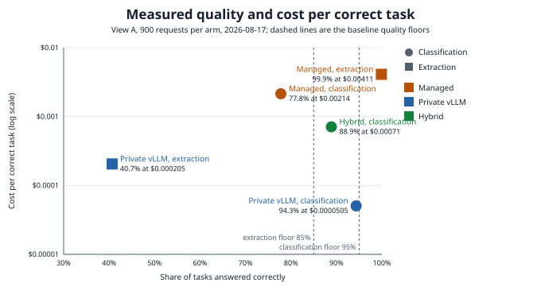
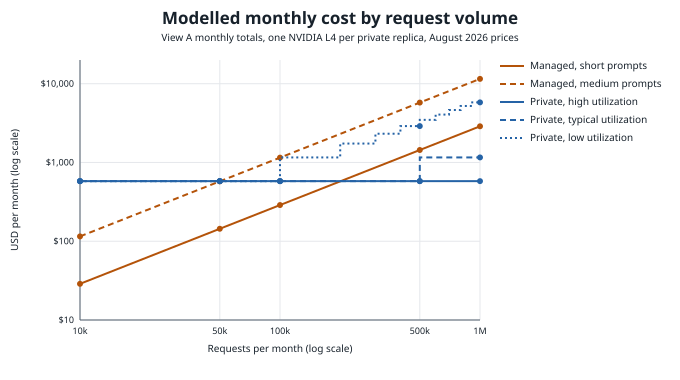

# Decision brief: managed API, private vLLM, or hybrid

This is the short version of what the published runs say, for someone deciding how to serve a
model. Methods, limits and raw evidence are in the [README](../README.md) and in each run's own
README under [results/published](../results/published/). Every number here comes from those runs
or from the cost inputs in [config/cost.example.yaml](../config/cost.example.yaml). Managed
prices are dated 2026-08-15 and infrastructure prices 2026-08-17.

What was compared: Claude Opus 5 through the Anthropic API as the managed path, and
Qwen2.5-7B-Instruct (AWQ) on vLLM 0.27.1 on one NVIDIA L4 (g6.xlarge, us-east-1) as the private
path. Each baseline and hybrid arm ran 300 synthetic items three times, 900 requests per arm.

## Short answer

- **Structured extraction: use the managed model.** It got 99.9% right. The 7B private model got
  40.7%, against a floor of 85%. No price difference makes up for that.
- **Classification: the private model was better and faster**, 94.3% correct against 77.8%, with
  p95 latency of 150 ms against 3.7 s. Neither met the premium floor of 95%. Opus 5 often used up
  the 64-token answer budget before answering, and those empty answers scored as failures; a
  higher budget was not measured.
- **Private cost depends on volume and utilization.** One L4 node costs about $579 a month on
  demand, busy or idle. In the View A model at typical or high utilization, and at the model's
  managed price of $0.00288 per short request, it pays for itself at about 201,000 short requests
  a month, or about 50,000 medium ones. Below that, managed costs less per month, even where the
  private model is more accurate.
- **Mixed traffic: only the cheaper tiers met their targets.** The hybrid run sent 602 of 900
  classification requests to the private model and landed at 88.9% correct for $0.00071 per
  correct task (View A). Its balanced and economy cells met their SLO targets. The premium cell
  failed on the same latency and quality limits as the managed baseline, so the combined figure is
  informational only.
- **Restricted data: private only.** Restricted traffic never left the private path in any run.
  When the private pod was deleted, restricted requests failed closed instead of falling back to
  the managed provider.

## Measured cost per correct task

| Workload | Managed | Private vLLM | Hybrid |
|---|---|---|---|
| Classification | 77.8% at $0.00214 | 94.3% at $0.0000505 | 88.9% at $0.00071 |
| Structured extraction | 99.9% at $0.00411 | 40.7% at $0.000205 | not run |

These are View A costs from the runs. Private cost covers GPU, CPU and model storage for the
span of the requests, with a 60-second minimum per repeat, which came to 0.05 billed hours for the
900 classification requests. The 42x gap on classification leaves out the rest of the time a
deployment keeps its node up, and GPU utilization was not measured. The monthly chart below
charges a full month of GPU node time per replica.

## Monthly cost by volume

This is the scenario model from the private classification run, not a measurement. Managed cost
grows with requests. Private cost is one month of L4 time per replica, and the number of replicas
depends on how many requests one replica is assumed to carry: 100,000 a month at low utilization,
500,000 at typical and 1,000,000 at high. Those tiers are planning assumptions, not throughput
limits: in the autoscaling run a single L4 carried almost all of 45,000 short classification
requests in under ten minutes, with the second replica Ready only in the last two.

What the model says:

- Short prompts, typical or high utilization: private wins between 100,000 and 500,000 requests
  a month. The arithmetic crossover is about 201,000.
- Medium prompts: the two are within $4 of each other at 50,000 a month, and private is cheaper
  at every grid volume from 100,000 up.
- Short prompts at low utilization: private is never cheaper in the grid. Each replica covers
  100,000 requests and costs about twice what managed charges for them.

View B, the full platform cost, adds gateway, NAT, control plane, storage, observability and an
operations allocation. The model adds the same amounts to both sides, so View B moves both lines
up without moving the crossover. If running your own GPU serving will take more engineering time
than calling an API, add that difference to the private side before deciding.

## Operating findings

- With a single vLLM replica, deleting its pod took 2 minutes 45 seconds to recover from and
  caused 160 timeouts in a 900-request run, which failed the error-rate target.
- In the provider-fault test, a fault service injected into the managed path returned 429s, 500s
  and timeouts for one in three premium requests. All 150 faulted requests failed over to the
  private path with no client-visible errors. Each injected timeout still cost about 30 seconds
  before failover, matching the response header timeout in
  [policy/routing.yaml](../policy/routing.yaml), and that was enough to fail the premium latency
  target.
- KEDA asked for a second replica about 10 seconds after load started, but that replica took
  7 minutes 40 seconds to become Ready on a GPU node that already existed. Scale-out on this stack
  followed a sustained load shift. Burst traffic was not tested.

## What this does not show

- One stack, one GPU type and one 7B model, measured on 17, 19 and 23 August 2026. A larger open
  model or another GPU would change both the quality and the monthly numbers.
- Synthetic datasets. Run your own evaluator on your own tasks before trusting either quality
  figure.
- Managed classification quality is held down by the 64-token budget. A rerun with a higher cap
  is future work.
- Prices are a dated snapshot and need refreshing before any new decision.

The [inference cost explorer](https://vjsairam.com/explorer/) runs the same scenario grid with
volume, prompt length and utilization as inputs. The charts are generated by
`uv run python scripts/decision-brief-charts.py` from the runs listed at the top of that script;
change the list and this page together.
